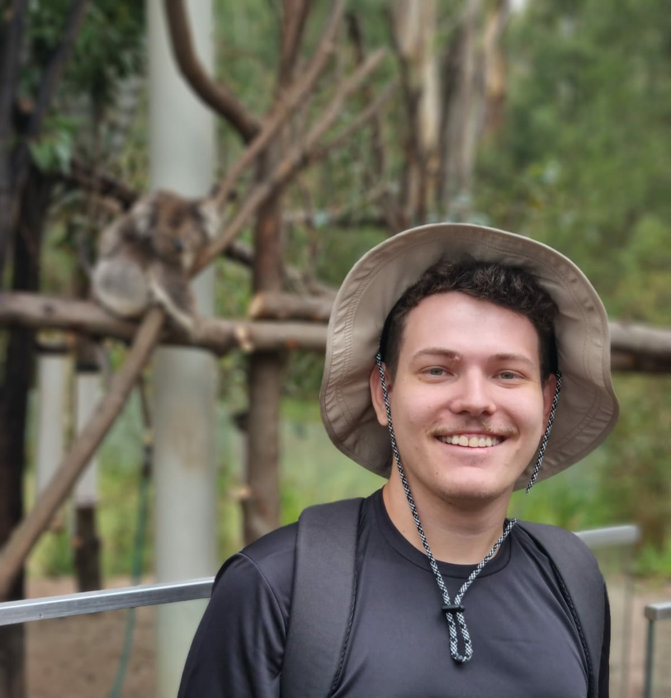

  

  <h1>Hello there!</h1>

  
My name is <strong>Rodrigo Stefanes</strong>. I am currently completing my Bachelor's degree in mathematics at the <a href="https://ufsc.br">Universidade Federal de Santa Catarina (UFSC)</a> in Brazil.

---

## Research

### Formal Methods
My main research interest is automated program verification. Currently, I am working on formally validating program verification tools.

### Mathematical Logic
I am also interested in Model Theory. In this area, I have recently submitted a paper regarding the model-theoretical aspects of modal logics:

* **Intrinsic and relative characterization results for logics with negative modalities**
  * *Jim de Groot, João Marcos, Rodrigo Stefanes*
  * Submitted (December 2025)
  * Available on [arXiv](https://arxiv.org/abs/2512.15496).

### Computer Science Projects
I also enjoy contributing to general Computer Science projects. Specifically, I have been working on **ranking and unranking algorithms**.

---

## Events and Talks

* **[Bern Logic Seminar](https://logicseminar.inf.unibe.ch/)** (Sep 2025)
    * *University of Bern, Bern, Switzerland*
    * Presented the talk: [Characterizing the expressiveness of inconsistency-tolerant modal logics](https://logicseminar.inf.unibe.ch/HS2025.html#Stefanes)

* **[Logic Summer School](https://comp.anu.edu.au/lss/lectures/2023/)** (Dec 2023)
    * *Australian National University (ANU), Canberra, Australia*
    * Attended the school as a participant
      
* **[Autumn school "Proof and Computation](https://www.mathematik.uni-muenchen.de/~schwicht/pc25.php)"** (Sep 2025)
    * *Herrsching, Germany*
    * Attended the school as a participant
    *       
* **[XXI Brazilian Logic Conference(EBL)](https://ebl2025.ime.usp.br/)** (May 2025)
    * *Serra Negra, Brazil*
    * Presented the talk: ["Simulating a Smile"](https://scholar.google.com.br/citations?view_op=view_citation&hl=pt-BR&user=CQHNtSwAAAAJ&citation_for_view=CQHNtSwAAAAJ:u5HHmVD_uO8C)
      
* **[14th Principia International Symposium](https://principia.ufsc.br/)** (July 2025)
    * *Florianópolis, Brazil*
    * Presented the talk: ["Characterizing the Expressiveness of Logics of Formal Inconsistency"](https://principia.ufsc.br/wpcontent/uploads/2025/07/14_Principia__Book_of_Abstracts__v11.pdf)

---

## Projects

* **Internship at [LabSEC](https://labsec.ufsc.br/)**
  * 01 August 2025 - 31 January 2026
* **Undergraduate Research Project**
  * Topic: Model theory of restoration operators 
  * Funded by the [PIBIC/CNPq fellowship program](https://pibic.ufsc.br/)
  * Advisor: [João Marcos](https://sites.google.com/site/sequiturquodlibet/)
  * 1 August 2025 - 31 August 2026
* **Undergraduate Research Project**
  * Topic: Functional Analysis
  * Funded by the [PIBIC/CNPq fellowship program](https://pibic.ufsc.br/)
  * Advisor: [Paulo Mendes de Carvalho Neto](https://pyrotraxus.wixsite.com/pcarvalho)
  * 1 September 2023 - 31 August 2024
* **Undergraduate Research Project**
  * Topic: Banach-Tarski paradox
  * Advisor: [Luiz Gustavo Cordeiro](https://luizgcordeiro.github.io/)
  * 1 September 2023 - 31 August 2024

---
## Organization

* **1st WITCH — Workshop on Interdisciplinary Topics in Consequence and Hypothetical reasoning** (July 2025)
  * Co-organizer 
  * Held at UFSC, Florianópolis
  * [Event Website](https://logicandlinguistics.ufsc.br/wp/witch-2025/)

* **2nd WITCH — Workshop on Interdisciplinary Topics in Consequence and Hypothetical reasoning** (November 2025)
  * Co-organizer
  * Held at UFSC, Florianópolis
  * [Event Website](https://logicandlinguistics.ufsc.br/wp/witch2-2025/)

--

## Teaching

* **Teaching Assistant - Logic I** (First Semester 2025)
  * Subject: Propositional Logic
  * Supervisor: [Prof. João Marcos](https://sites.google.com/site/sequiturquodlibet/)

* **Teaching Assistant - Logic II** (Second Semester 2024)
  * Subject: First Order Logic
  * Supervisor: [Prof. João Marcos](https://sites.google.com/site/sequiturquodlibet/)

---

## Education

* **B.Sc. in Mathematics** (Expected 2026)
    * Universidade Federal de Santa Catarina (UFSC)
* **[Advanced mathematics program (PAM)](http://pam.mtm.ufsc.br/)**
  * A 756-hour honors program in mathematics
* **XXV Summer School**
  * Completed a 108-hour graduate-level course on **Functional Analysis**
