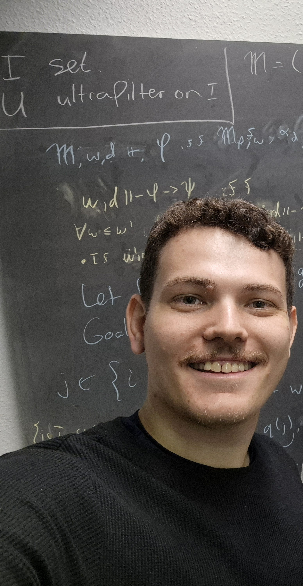

  

  <h1>Hello there!</h1>

  
My name is <strong>Rodrigo Stefanes</strong>. I am currently completing my Bachelor's degree in Mathematics at the <a href="https://ufsc.br">Universidade Federal de Santa Catarina (UFSC)</a> in Brazil.

  rodrigoamstefanes [at] gmail [dot] com 

---

## Research

 
My academic interests lie primarily in <strong>Logic</strong> and its applications to computer science.

---
## Publications & Preprints

* **Intrinsic and relative characterization results for logics with negative modalities**
  * *Jim de Groot, João Marcos, Rodrigo Stefanes*
  * Submitted (December 2025)
  * Available on [arXiv](https://arxiv.org/abs/2512.15496)
 
* **Combinatorial ranking algorithms for the general linear group**
  * *Gustavo	Zambonin, Larissa	Rosa, Tiago	Siqueira, Rodrigo	Stefanes, Ricardo	Custódio, Daniel Panario*
  * Accepted to the 17th Latin American Theoretical Informatics Symposium
 
* **Intuitionistic K is a bisimulation-invariant fragment of first order intuitionistic logic**
  * *Jim de Groot, João Marcos, Rodrigo Stefanes*
  * Accepted to Advances in Modal Logic 2026

---
## Talks

### Invited Talks
* **[Bern Logic Seminar](https://logicseminar.inf.unibe.ch/)** (Sep 2025)
  * *University of Bern, Bern, Switzerland*
  * Presented the talk: [Characterizing the expressiveness of inconsistency-tolerant modal logics](https://logicseminar.inf.unibe.ch/HS2025.html#Stefanes)

### Contributed Talks
* **[XXI Brazilian Logic Conference(EBL)](https://ebl2025.ime.usp.br/)** (May 2025)
  * *Serra Negra, Brazil*
  * Presented the talk: ["Simulating a Smile"](https://scholar.google.com.br/citations?view_op=view_citation&hl=pt-BR&user=CQHNtSwAAAAJ&citation_for_view=CQHNtSwAAAAJ:u5HHmVD_uO8C)
  
* **[14th Principia International Symposium](https://principia.ufsc.br/)** (July 2025)
  * *Florianópolis, Brazil*
  * Presented the talk: ["Characterizing the Expressiveness of Logics of Formal Inconsistency"](https://principia.ufsc.br/wp-content/uploads/2025/07/14_Principia__Book_of_Abstracts__v11.pdf)

---
## Education

* **B.Sc. in Mathematics with Honours** (Jan 2023 - Dec 2026)
    * Universidade Federal de Santa Catarina (UFSC)
    * **Honours Track:** 756 hours of additional advanced coursework (2 years)
* **[Logic Summer School](https://comp.anu.edu.au/lss/lectures/2023/)** (Dec 2023)
    * *Australian National University (ANU), Canberra, Australia*
    * Attended the school as a participant
* **[Autumn school "Proof and Computation"](https://www.mathematik.uni-muenchen.de/~schwicht/pc25.php)** (Sep 2025)
    * *Herrsching, Germany*
    * Attended the school as a participant
* **Graduate Courses**
  * 108-hour Functional Analysis course
  * 72-hour First-Order Modal Logic course
 
## Awards and Scholarships

* **Research Fellowship** (Since Feb 2026)
  * [LabSEC](https://labsec.ufsc.br/)

* **PIBIC/CNPq Fellowship** (Aug 2025 - Aug 2026)
  * National research grant funded by the Brazilian National Council for Scientific and Technological Development
  * Project: Towards a more generous approach to the Theory of Consequences – Field of Knowledge: Logic – Advisor: [João Marcos](https://sites.google.com/site/sequiturquodlibet/)
 
* **PIBIC/CNPq Fellowship** (Sep 2023 - Aug 2024)
  * National research grant funded by the Brazilian National Council for Scientific and Technological Development
  * Project: Differential Equations from the Perspective of Fractional Calculus – Field of Knowledge: Analysis – Advisor: Paulo Mendes de Carvalho Neto
 
* **Academic Merit Distinction** 
Universidade Federal de Santa Catarina, Brazil – Awarded for outstanding academic performance in all completed semesters to date

* **Undergraduate Research Project** ( Sep 2023 - Aug 2024)
  * Project: Banach-Tarski Paradox - Field of Knowledge: Mathematics - Advisor [Luiz Gustavo Cordeiro](https://luizgcordeiro.github.io/)

---
## Academic Service

* **1st WITCH — Workshop on Interdisciplinary Topics in Consequence and Hypothetical reasoning** (July 2025)
  * Co-organizer 
  * Held at UFSC, Florianópolis
  * [Event Website](https://logicandlinguistics.ufsc.br/wp/witch-2025/)

* **2nd WITCH — Workshop on Interdisciplinary Topics in Consequence and Hypothetical reasoning** (November 2025)
  * Co-organizer
  * Held at UFSC, Florianópolis
  * [Event Website](https://logicandlinguistics.ufsc.br/wp/witch2-2025/)

* **3rd WITCH — Workshop on Interdisciplinary Topics in Consequence and Hypothetical reasoning** (May 2026)
  * Co-organizer 
  * Held at UFSC, Florianópolis
  * [Event Website](https://logicandlinguistics.ufsc.br/wp/witch3-2026/)

* **Teaching Assistant - Logic I** (First Semester 2025)
  * Subject: Propositional Logic
  * Supervisor: [João Marcos](https://sites.google.com/site/sequiturquodlibet/)

* **Teaching Assistant - Logic II** (Second Semester 2024)
  * Subject: First Order Logic
  * Supervisor: [João Marcos](https://sites.google.com/site/sequiturquodlibet/)

---

